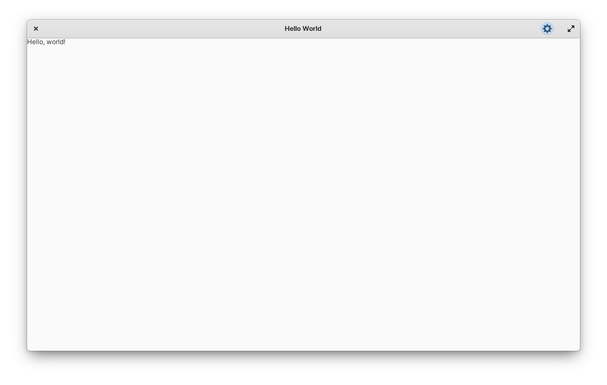
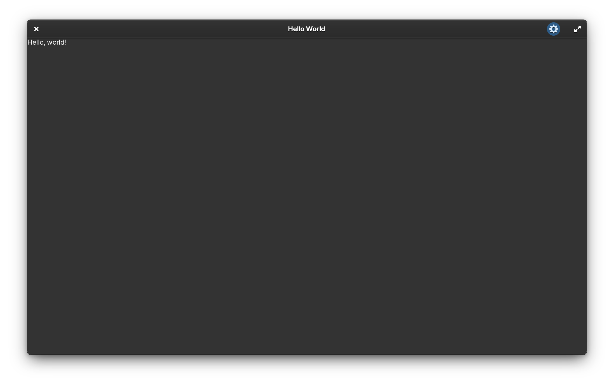

<p align="center">
  
</p>
<h1 align="center">{{cookiecutter.project_display_name}}</h1>
<!-- <p align="center">
  <a href="https://appcenter.elementary.io/com.github.{{cookiecutter.org_username}}.{{cookiecutter.project_simple_name}}"></a>
</p> -->

## TODO: Tagline

TODO: Application summary.

|  |  |
|------------------------------------------------------------------|------------------------------------------------------------------|

## Install from Source

You can install {{cookiecutter.project_display_name}} by compiling from source. Here's the list of
dependencies required:

- `libgranite (>= 6.2.0)`
- `libgtk-3-dev (>= 3.24.20)`
- `libgee-0.8-dev (>= 3.24.20)`
- `libhandy-1-dev (>= 1.2.0)`
- `meson`
- `valac (>= 0.28.0)`

## Building and Running

```
$ meson build --prefix=/usr
$ sudo ninja -C build install
$ {{cookiecutter.project_id}}
```

### Flatpak

Flatpak is the preferred method of building {{cookiecutter.project_display_name}}:

```bash
$ flatpak-builder build {{cookiecutter.project_id}}.yml --user --install --force-clean
$ flatpak run --env=G_MESSAGES_DEBUG=all {{cookiecutter.project_id}}
```

### Updating Translations

When new translatable strings are added, ensure that `po/POTFILES` contains a
reference to the file with the translatable string.

Update the `.pot` file which contains the translatable strings:

```
$ ninja -C build {{cookiecutter.project_id}}-pot
```

Generate translations for the languages listed in the `po/LINGUAS` files:

```
$ ninja -C build {{cookiecutter.project_id}}-update-po
```